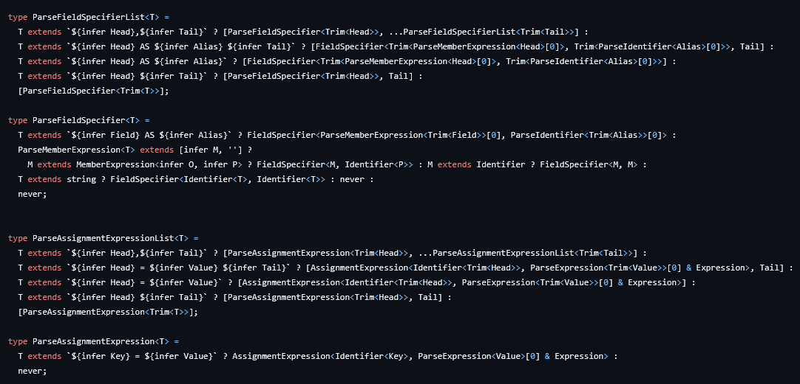
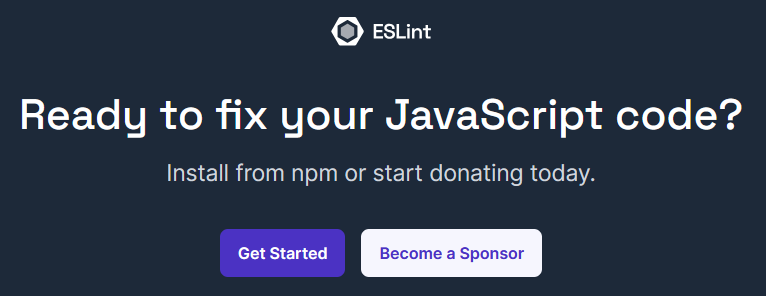
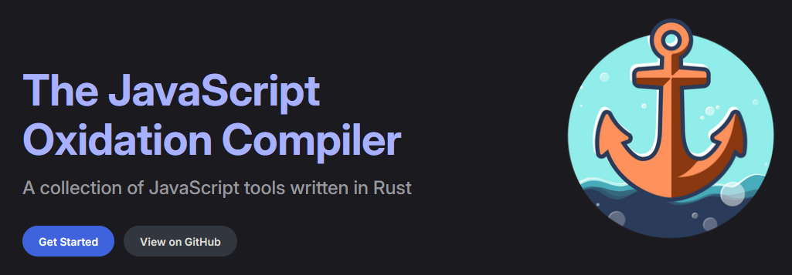
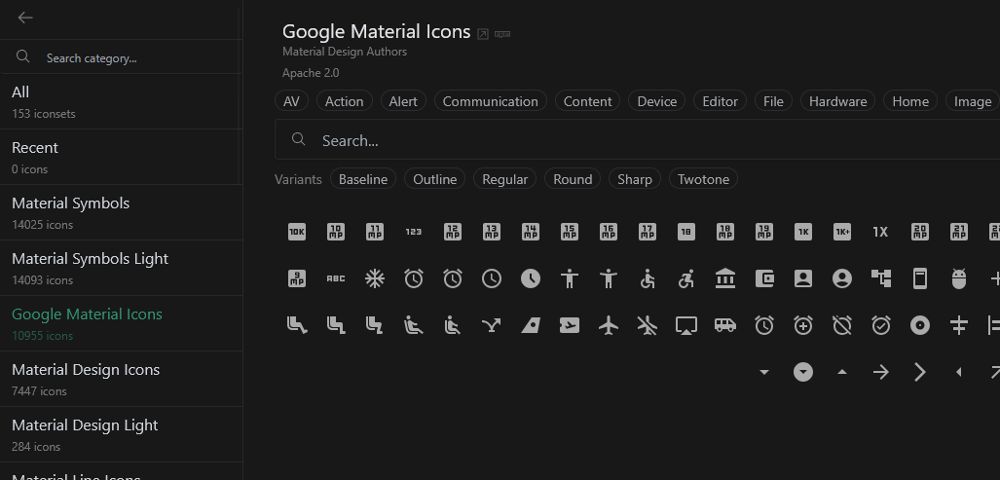

---
# You can also start simply with 'default'
theme: seriph
# random image from a curated Unsplash collection by Anthony
# like them? see https://unsplash.com/collections/94734566/slidev
background: https://plus.unsplash.com/premium_photo-1670872717035-d84647297aa8?q=80&w=1740&auto=format&fit=crop&ixlib=rb-4.1.0&ixid=M3wxMjA3fDB8MHxwaG90by1wYWdlfHx8fGVufDB8fHx8fA%3D%3D
# some information about your slides (markdown enabled)
title: Vusioglobe
titleTemplate: '%s'
# apply unocss classes to the current slide
class: text-center
# https://sli.dev/features/drawing
drawings:
  persist: false
# slide transition: https://sli.dev/guide/animations.html#slide-transitions
transition: slide-left
# enable MDC Syntax: https://sli.dev/features/mdc
mdc: true
colorSchema: dark
fonts:
  sans: Comic Neue
favicon: 'https://cdn.francetravail.fr/studio/logos/marque/favicon/favicon.svg'
---

# Vusioglobe

Présentation d'outils à utiliser dans vos projets vue

---

# Voici quelques outils bien sympatiques :

(par ordre de sympathie)

- Typescript
- Linter
- VueUse
- UnJS / auto import
- Composants headless
- Tailwind
- Iconify

---

# [Typescript](https://www.typescriptlang.org/)

Utilisez typescript s'il vous plait ceci est un appel à l'aide.

Un projet bien typé est un projet sain




---

# Choisissez un linter

- Détecter les erreurs
- Applique des rêgles de formatage

On utilise : [ESLint](https://eslint.style/)



Nouveau cool kid : [Oxc](https://oxc.rs/)



---

# [VueUse](https://vueuse.org/)

Une collection de composables d'utilité publique

```vue
<script setup lang="ts">
import { useMouse } from '@vueuse/core';

const { x, y } = useMouse()
</script>

<template>
  Pointer X : {{ x }}<br>
  Pointer Y : {{ y }}
</template>
```

C'est réactif !

<WindowSize />

<br>
<br>

`useStorage`, `useElementSize`, `useWindowScroll`, `useBreakpoints`, `useClipboard`, `useTitle`, `useFocus`, `useFps`, `useWebSocket`, `useVirtualList`, 
`useDateFormat`, `useTimeAgo`, `useDraggable`, `useMouseInElement`, `useDark`, `useCeQueVousVoulez`, `useCaffée`, `useJacuzzi`, `usePizza4Fromage`,

---

# UnJS / auto import

\- de code = + de place pour plus de code 

Grace à [`unplugin-auto-import`](https://github.com/unplugin/unplugin-auto-import)
et [`unplugin-vue-components`](https://github.com/unplugin/unplugin-vue-components)

````md magic-move {lines: true}
```vue
<script setup lang="ts">
import { useMouse } from '@vueuse/core';
import AppHeader from '@/components/AppHeader.vue'

const { x, y } = useMouse()
</script>

<template>
  <AppHeader />
</template>
```

```vue
<script setup lang="ts">
const { x, y } = useMouse()
</script>

<template>
  <AppHeader />
</template>
```
````

---

# Composants headless / non stylisés

Comme une bibliothèque de composants, mais sans CSS

Un exemple avec [`HeadlessUI`](https://headlessui.com/v1/vue):

````md magic-move {lines: true}
```vue
<template>
  <Dialog :open="isOpen" @close="setIsOpen">
    <DialogPanel>
      <DialogTitle>Deactivate account</DialogTitle>

      <button @click="setIsOpen(false)">Deactivate</button>
      <button @click="setIsOpen(false)">Cancel</button>
    </DialogPanel>
  </Dialog>
</template>

<script setup>
  const isOpen = ref(true)

  function setIsOpen(value) {
    isOpen.value = value
  }
</script>
```
```vue
<template>
  <Dialog :open="isOpen" @close="setIsOpen">
    <DialogPanel class="rounded bg-white shadow">
      <DialogTitle class="text-xl text-bold">Deactivate account</DialogTitle>

      <button @click="setIsOpen(false)" class="btn">Deactivate</button>
      <button @click="setIsOpen(false)" class="btn">Cancel</button>
    </DialogPanel>
  </Dialog>
</template>

<script setup>
  const isOpen = ref(true)

  function setIsOpen(value) {
    isOpen.value = value
  }
</script>
```
````

A tester : **Radix Vue**

---

# [Tailwind CSS](https://tailwindcss.com/)

\<div class="flex items-center justify-center">

Plus besoin de réecrire dans chaques projets :

```css
.container {
  display: flex; align_items: center; justify-content: center
}
```

Avantages :

- Plus besoin d'écrire du css
- Moins de css dans le bundle final
- Meilleur collaboration d'équipe

Inconvénients :
- Peu devenir illisible si mal utilisé (mais je sais que vous être de super dev donc ca ne devrait pas arriver) 

---

# Iconify

200 000 icônes open source

Une liste se trouve ici https://icones.js.org/ :



---
